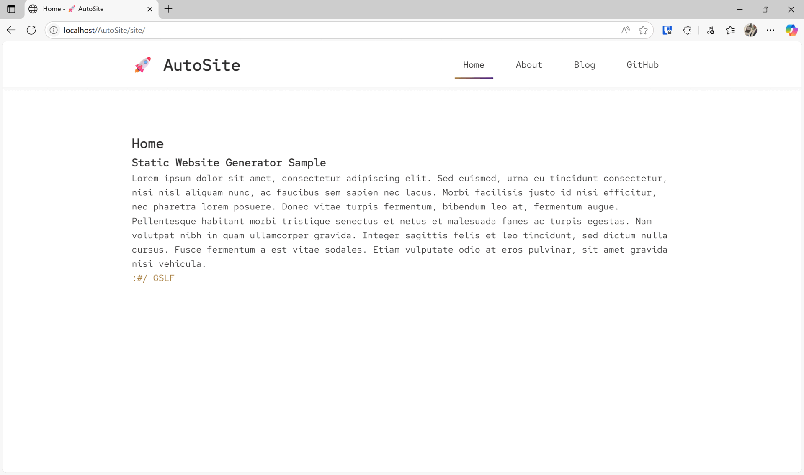

<div align="center">

# 🚀 AutoSite

### A Modern Markdown-Based Static Site Generator

*Transform Markdown content into beautiful, responsive websites with zero configuration*

[](https://python.org)
[](LICENSE)
[](https://github.com/psf/black)

---

</div>

## ✨ Features

- **🔥 Zero Configuration** - Get started with a single command
- **📝 Markdown-Powered** - Write content in clean, simple Markdown
- **🎨 Minimal Themes** - Customizable colors and fonts
- **📱 Mobile Responsive** - Looks perfect on all devices
- **⚡ Lightning Fast** - Generates sites in milliseconds
- **🗂️ Smart Navigation** - Automatic menu generation from your content
- **🔢 Intelligent Sorting** - Number-based article ordering with clean URLs
- **📄 Pagination** - Built-in pagination for blog posts and collections
- **🔗 External Links** - Seamlessly integrate external resources
- **🎯 SEO Friendly** - Clean HTML structure optimized for search engines
- **🌙 Minimal Design** - Clean, professional aesthetic with smooth animations

## 🖼️ Demo



*Screenshot showing a generated website with custom theme and navigation*

## 🚀 Quick Start

Get your static site running in under 2 minutes:

### 📋 Prerequisites

- Python 3.8 or higher
- pip package manager

### 🔧 Installation

1. **Clone the repository**
   ```bash
   git clone https://github.com/gslf/AutoSite.git
   cd AutoSite
   ```

2. **Install dependencies**
   ```bash
   pip install -r requirements.txt
   ```

3. **Generate your first site**
   ```bash
   python gen.py
   ```

4. **View your site**
   Open `site/index.html` in your browser or serve it locally:
   ```bash
   # Using Python's built-in server
   cd site
   python -m http.server 8000
   ```
   
   Navigate to `http://localhost:8000` to see your site! 🎉

## 📁 Project Structure

```
AutoSite/
├── 📄 config.yaml          # Site configuration
├── 🐍 gen.py              # Main generator script
├── 📝 content/            # Your content files
│   ├── home.md           # Homepage content
│   ├── about.md          # About page
│   └── blog/             # Blog posts directory
│       ├── 1-post1.md    # Numbered posts for ordering
│       ├── 2-post2.md
│       ├── 3-post3.md
│       └── ...
├── 🎨 assets/             # Custom assets (fonts, images)
├── 🏗️ templates/          # HTML templates
├── 🔧 core/               # Core functionality
├── ⚙️ generators/         # Content generators
└── 🌐 site/               # Generated website (output)
```

## ⚙️ Configuration

Customize your site by editing `config.yaml`:

```yaml
# Website title
title: "My Awesome Site"

# Base URL (for subdirectories)
base_url: "/my-site"

# Theme customization
theme:
  font_family: "'Inter', 'Arial', sans-serif"
  primary_color: "#3b82f6"
  contrast_color: "#1e40af"

# Homepage content
homepage: "content/home.md"

# Navigation pages
pages:
  - title: "About"
    path: "content/about.md"
  
  - title: "Blog"
    path: "content/blog"
  
  - title: "GitHub"
    path: "https://github.com/username"
```

### 🎯 Configuration Options

| Option | Description | Example |
|--------|-------------|---------|
| `title` | Site title shown in header and browser tabs | `"My Blog"` |
| `base_url` | Base URL for hosting in subdirectories | `"/blog"` |
| `homepage` | Path to homepage Markdown file | `"content/home.md"` |
| `theme.font_family` | CSS font family for the site | `"'Roboto', sans-serif"` |
| `theme.primary_color` | Primary color (hex) | `"#ff6b6b"` |
| `theme.contrast_color` | Accent color (hex) | `"#4ecdc4"` |

## 📋 Content Organization

### 🔢 Article Ordering System

AutoSite uses an intelligent article ordering system based on number prefixes in filenames. This system allows you to control the display order of content without affecting the final URL.

#### How It Works

Files in the `content/blog/` folder (or other content folders) can be prefixed with a number followed by a dash:

```
content/blog/
├── 1-introduction.md      # First article
├── 2-basic-tutorial.md    # Second article
├── 3-configuration.md     # Third article
├── 10-conclusions.md      # Tenth article
└── 15-appendix.md         # Fifteenth article
```

#### System Features

- **🎯 Numeric Ordering**: Articles are sorted based on the number prefix
- **🔗 Clean URLs**: The number doesn't appear in the final URL (`/blog/introduction.html` instead of `/blog/1-introduction.html`)
- **📝 Clean Titles**: Article titles don't include the number prefix
- **🔄 Flexibility**: Easy reordering by simply changing the numbers
- **📊 Gap Support**: Numbers don't need to be consecutive (1, 2, 5, 10 works perfectly)

#### Practical Examples

```markdown
# File: 1-welcome.md
# Generated URL: /blog/welcome.html
# Position: First in the list

# File: 5-advanced-tutorial.md  
# Generated URL: /blog/advanced-tutorial.html
# Position: After all articles with number < 5

# File: 10-conclusions.md
# Generated URL: /blog/conclusions.html
# Position: Last in the list (if it's the highest number)
```

#### Files Without Numbering

Files without a number prefix are sorted alphabetically and positioned after all numbered files.


## 🎨 Theme customization


### 🎨 Custom Colors

```yaml
theme:
  primary_color: "#ff6b6b"    # Links, buttons, accents
  contrast_color: "#4ecdc4"   # Hover states, highlights
```

### 🔤 Custom Fonts

```yaml
theme:
  font_family: "'Poppins', 'Arial', sans-serif"
```

Add custom font files to the `assets/` directory and reference them in your CSS.

### 🎯 Advanced Customization

- **CSS**: Modify styles in `templates/assets.py`
- **HTML**: Edit templates in `templates/`
- **JavaScript**: Enhance interactivity in the JS template

## 🔧 Advanced Usage

### Custom Build Options

```bash
# Custom configuration file
python gen.py --config my-config.yaml

# Custom output directory
python gen.py --output dist/

# Custom pagination
python gen.py --paginate-by 5
```

### Programmatic Usage

```python
from site_generator import generate_site

# Generate with custom settings
generate_site(
    config_path='config.yaml',
    output_dir='build/',
    paginate_by=15
)
```


## 📄 License

This project is licensed under the MIT License - see the [LICENSE](LICENSE) file for details.


---

<div align="center">

**⭐ Star this repo if you find it useful!**

Made with ❤️ by [GSLF](https://gslf.it)

[Report Bug](https://github.com/gslf/AutoSite/issues) • [Request Feature](https://github.com/gslf/AutoSite/issues) • [Documentation](https://github.com/gslf/AutoSite/wiki)

</div>